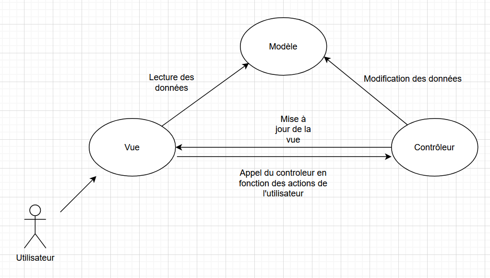
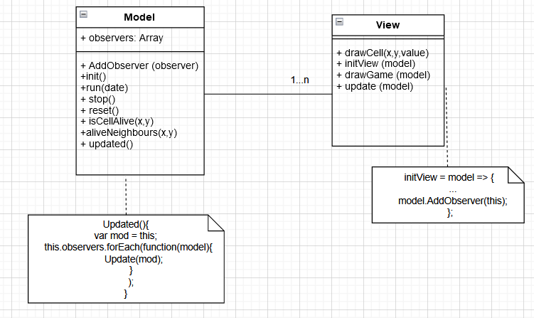

# ISI3 - MVC design pattern - "Game of Life"

> Le rapport est à fournir dans ce document sous chacune des questions.

> Ne copiez pas le code de votre voisin, ça se voit.

Nom/Prénom: DJELLAS Lisa CORREIA Lucas  

Lien du codesandbox: (https://codesandbox.io/s/github/PolytechLyon/isi3-tp-javascript-mvc-ini-correia_djellas_tp7)

> Pour générer un codesandbox associé à votre code, [suivre cette doc](https://codesandbox.io/docs/importing#import-from-github).

Vous pouvez tester le code directement sur votre navigateur, à condition de lancer un serveur local. Par exemple :

```python3 -m http.server 8000```

Votre programme sera accessible depuis l'adresse `http://localhost:8000/index.html`.


## Game of Life

Le jeu de la vie est un automate cellulaire qui répond à des règles très simple.
Il a été inventé par [John Horton Conway](https://fr.wikipedia.org/wiki/John_Horton_Conway) (1937-2020).

## Avant-propos

1. Expliquer le design pattern MVC à l'aide d'un schéma à insérer directement ici.
Utiliser un outils comme Dia pour le représenter. Je veux **votre** schéma, pas un de ceux qu'on peut trouver sur le net.



2. Expliquer ce pattern en complétant ce texte.

Le pattern MVC, vise à découper le modèle, de la vue et du contrôleur afin de rendre le code plus séparé, organisé et clair.
Les responsabilités ne sont alors plus cycliques.
On peut ainsi changer l'aspect visuel de son application sans pour autant impacter le modèle.

3. Expliquer dans quels cas on doit privilégier le pattern MVC. 
Le pattern MVC est très utile pour des applications web, ou tout types d'application disposant d'une interface graphique, étant donné que l'on va forcément disposer d'une vue, avec laquelle l'utilisateur va pouvoir interagir. 

Cependant, avec certaines nouvelles technologies comme react ou Angular, l'architecture utilisée est l'architecture MVVM (Model - View - ViewModel)

## À faire (obligatoire)

- Rendre le jeu fonctionel tout en respectant le design pattern MVC.
- Le bouton `start` doit lancer le jeu.
- Le bouton `stop` doit arrêter le jeu en l'état, le `start` relance le jeu.
- le bouton `reset` arrête le jeu et remet à la grille à l'état initial.

### Observer Observable

Afin de mettre à jour la vue à chaque nouvelle génération du jeu, la fonction `updated` doit notifier la view afin qu'elle se mette à jour.
Cela relève du design pattern Observer/Observable.

1. Expliquer votre implémentation:

L'usage d'un callback permet ici d'appeler la fonction Update de la vue, afin de dire à la _View_ de se redessiner.
L'objet _Model_ n'a pas de lien avec la _View_ pourtant grâce à la fonction updated il peut notifier la _View_.

2. Insérer ici un UML montrant le pattern Observer/Observable lié aux objets de ce TP.

## Optionnel

> Si vous voulez apprendre d'autres choses

- Faire en sorte de pouvoir changer les dimensions de la grille par un `<input/>` HTML.
J'ai fait en sortes de pouvoir modifier la veleur de l'ancienne constance GAME_SIZE à travers le controller, 
- Faire en sorte de pouvoir modifier l'état d'une cellule en cliquant dessus.

## :warning: À rendre

- Une URL de codesandox pointant sur votre projet github afin que je puisse voir et tester le code.
- Le rapport complet.
